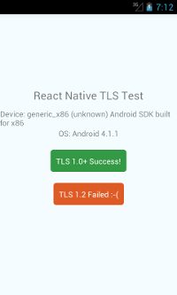

# React Native TLS Test

Android has official support for TLS 1.1 and 1.2 since version 5.0 ("Marshmallow"). Android 4.1-4.4 has also support for it, but it needs to be enabled. React Native does correctly not do this (see [corresponding issue](https://github.com/facebook/react-native/issues/7192)).

This is a little demo app for demonstrating the issue and to test the patch for enabling the support.

The app is quite minimal and has only two buttons, each performing a minmal HTTPS request against the following two webservers:

* [https://tls-tests.cute.systems:446/](https://tls-tests.cute.systems:446/): NGINX 1.10.1 accepting TLS 1.0+ connections ([config file](./server/nginx-tls1.0-1.2.conf).
* [https://tls-tests.cute.systems:444/](https://tls-tests.cute.systems:446/): NGINX 1.10.1 accepting TLS 1.2 connections only ([config file](./server/nginx-tls1.2.conf).

There are two variants of the app:

* `react-native-stock`: using the stock react-native (version 0.33 at the moment)
* `react-native-patched`: using [our react-native branch](https://github.com/bringnow/react-native/tree/enable-tls-1.2) including a patch to enable TLS 1.1-1.2 on Android 4.1-4.4.

The results show the patch actually work:

**Using the *stock* react-native on Android 4.1**:

**Using the *patched* react-native on Android 4.1**:

## Try for yourself

The patched react-native is not prebuilt like the stock one from npm, so you have to built it on your machine. This actually happens automatically, you just have to ensure you installed the Android NDK like [described in the react-native docs](https://facebook.github.io/react-native/docs/android-building-from-source.html).

Then you only have to enter the subdirectory of the variant you want to test (`react-native-stock` or `react-native-patched`) and run the app like every other react-native app using `react-native run-android`.
